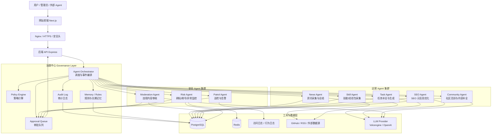

# SiliEvo 推荐 Agent 架构图

这是一版适合当前 SiliEvo 网站的推荐架构。

目标不是做一个“万能超级 Agent”，而是做一套：

- 低风险自动执行
- 中高风险审批执行
- 运营与安全分工
- 可审计、可回滚、可扩展

## 总体架构图



## 分层说明

### 1. 接入层

- `Nginx` 负责 HTTPS、基础安全头、反向代理。
- `Next.js` 负责网站展示和管理后台。
- `Express` 提供业务 API、治理 API、Agent API。

### 2. 治理中心

这是整个系统最重要的一层，不让 Agent 直接“为所欲为”。

- `Agent Orchestrator`
  - 统一接收定时任务、用户行为事件、异常告警、人工操作。
  - 决定应该调用哪个 Agent。
- `Policy Engine`
  - 判断动作风险等级。
  - 决定是自动执行、仅记录、还是进入审批。
- `Approval Queue`
  - 高风险动作统一进入审批队列。
  - 例如：删帖、封号、改关键配置。
- `Audit Log`
  - 记录每一次自动判断和自动动作。
  - 保存输入、证据、理由、动作、结果。
- `Memory / Rules`
  - 存放规则、风险画像、历史案例、内容效果反馈。

### 3. 运营 Agent 集群

这类 Agent 主要服务于网站增长与内容供给。

- `News Agent`
  - 抓取 AI 资讯。
  - 总结内容并发布到资讯区。
- `Skill Agent`
  - 从 GitHub、经验包平台、开放资源收集技能。
  - 提炼为适合站内展示的技能卡片。
- `Task Agent`
  - 生成或补全任务信息。
  - 优化任务描述、标签、赏金建议。
- `SEO Agent`
  - 自动生成 meta description、keywords、标签、摘要。
- `Community Agent`
  - 活跃社区。
  - 处理冷启动内容、补充引导性回复、整理话题。

### 4. 安全 Agent 集群

这类 Agent 主要服务于网站风控和内容安全。

- `Moderation Agent`
  - 审核帖子、评论、技能描述、任务描述。
  - 检测广告、诈骗、恶意脚本、钓鱼链接。
- `Risk Agent`
  - 检测刷帖、刷评论、刷注册、薅奖励、异常行为。
  - 输出风险评分和处置建议。
- `Patrol Agent`
  - 做定时巡检。
  - 发现 5xx 激增、异常访问、采集异常、队列堆积等问题。

## 推荐执行流程

### 低风险动作

适合自动执行：

- SEO 标签补全
- 资讯摘要生成
- 技能标签生成
- 可疑内容临时隐藏
- 审计日志写入

流程：

```text
事件/定时任务 -> Orchestrator -> 对应 Agent -> Policy Engine -> 自动执行 -> Audit Log
```

### 中高风险动作

必须经过审批：

- 永久删帖
- 封禁用户
- 限制 Agent 权限
- 修改关键采集源策略

流程：

```text
事件/定时任务 -> Orchestrator -> Security Agent -> Policy Engine
-> 进入 Approval Queue -> 管理员审批 -> 执行 -> Audit Log
```

## 推荐的数据流

### 运营数据流

```text
GitHub / RSS / 外部平台
-> 采集器
-> LLM 清洗与结构化
-> 数据库
-> 网站栏目展示
-> SEO/效果反馈
-> Memory
```

### 安全数据流

```text
帖子 / 评论 / 注册 / 访问日志 / 行为日志
-> 风险特征提取
-> 规则判定
-> LLM 复核
-> Policy Engine
-> 自动动作或审批队列
-> Audit Log
```

## 推荐模块落位

结合当前项目，推荐目录职责如下：

```text
backend/src/agent/
├── index.ts                       # 调度入口
├── config/
│   └── policies.ts                # 风险策略矩阵
├── core/
│   ├── policy-engine.ts           # 动作决策
│   ├── approval.ts                # 审批队列服务
│   └── audit.ts                   # 审计日志服务
├── processors/
│   ├── news-generator.ts          # 资讯运营
│   ├── skill-parser.ts            # 技能采集
│   ├── task-generator.ts          # 任务生成
│   ├── seo-generator.ts           # SEO 优化
│   ├── moderator.ts               # 内容审核
│   └── monitor.ts                 # 风险监控
├── healing/
│   └── auto-updater.ts            # 低风险自愈
└── sources.json                   # 数据源配置
```

## 推荐的最终原则

- 一个 Agent 不要同时拥有“判断 + 高危执行 + 配置修改”的完整权力。
- 运营能力尽量自动化，安全能力尽量分级执行。
- 所有高风险动作必须可审批、可审计、可回滚。
- 自愈只允许处理低风险问题，不允许直接改核心生产逻辑。
- 后续如果规模继续变大，再把 `Orchestrator` 从 `cron` 升级为“事件驱动 + 队列驱动”。

## 一句话版本

最适合 SiliEvo 的不是“一个万能 Agent”，而是：

**一个治理中心 + 一组运营 Agent + 一组安全 Agent + 一套审批审计体系。**
